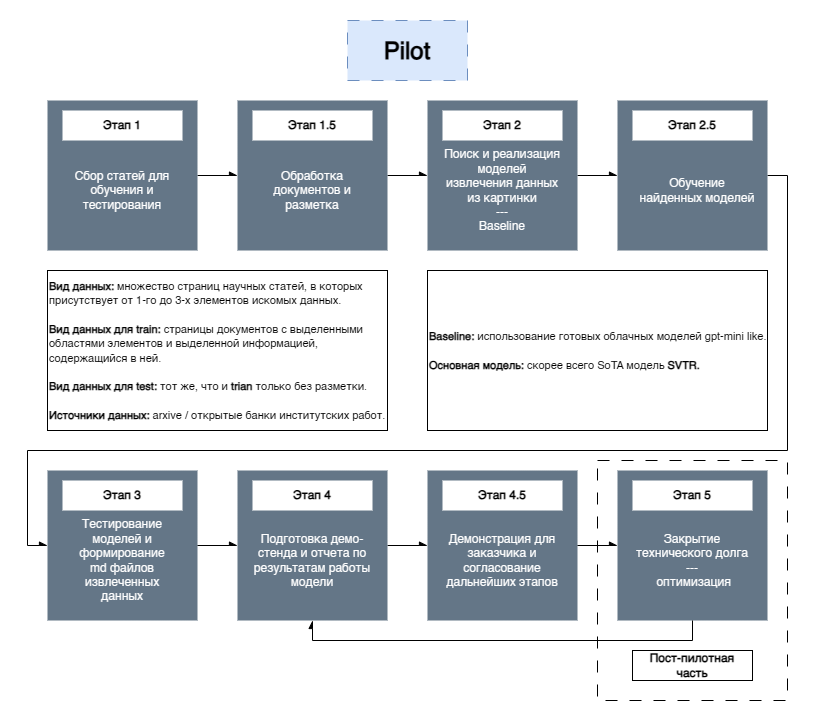

# ML System Design Doc - [RU]
## Дизайн ML системы - ScientificPaper-IR v0.1.0

### 0. Термины
> `связанная информация` - последовательность фраз / блоков текста, имеющих логическую связь: например, в потенциально сравнении древних цивилазций пары `Финикия - 1200-332 г. до н. э.`, `Цивилизация Ольмеков - 1200-401 г. н. э.` и `Цивилизация Хеттов - 1600-1178 г. до н. э.` будут являться такой информацией.
> 
> `общая информация (abstract)` - краткая выжимка научной статьи / её основные концепции.
>
> `работа на локальных мощностях` - объединение двух возможных вариантов работы: на устройстве (без доступа в интернет), а также в браузере с учетом запуска бэкенда на серверах компании.

### 1. Цели и предпосылки
#### 1.1. Зачем идем в разработку продукта?

- **Бизнес-цель:**
    Создание системы для автоматического извлечения ключевой информации из научных pdf-документов, что позволяет ускорить процесс анализа научных статей и внедрение концепций, изложенных в нх, в продукты компании.

- **Почему станет лучше:**
    В отличие от существующих решений, которые предлагают исключительно извлечение таблиц, система будет поддерживать извлечение данных из графиков и схем, а также связанной и общей информации. Всё будет работать локально, позволяя обрабатывать закрытые разработки компании.

- **Что будем считать успехом:**
    Успехом будет считаться достижение определенных метрик качества:
  - Точность совпадения табличных данных ≥ 90%.
  - Точность извлеченных данных из нетабличных источников информации ≥ 85%.
  - Снижение среднего времени работы со статьями.

#### 1.2. Бизнес-требования и ограничения

- **Краткое описание требований:**
    Система должна обеспечивать быстроту высокую точность извлечения данных из таблиц и графиков из файлов в формате PDF. Система должна уметь работать с данным PDF в различном формате: текстовом и графическом.

- **Бизнес-ограничения:**
     - Поддержка научных PDF-документов на русском языке.
     - Ограничения по времени обработки документа: не более 10 секунд на документ среднего размера (10–15 страниц).
     - Извлечение должно производится в md формат.
     - Минимальные требования к запуску на устройстве:
        - Nvidia GeForce GTX 1650
        - Intel Core i7 12 gen
        - 32 Gb RAM
        - **или**
        - Apple M2
        - 32 Gb RAM

> Ввиду отсутствия больших обучающих мощностей (они могут меняться по ходу разработки) и наличие выделенного времени на разработку (свыше 6 месяцев) допускается снижение метрик качества для запуска пилота.
>
> Пилот должен быть выпущен не позднее чем через **2 месяца** после начала разработки.

- **Что мы ожидаем от конкретной итерации:**
    Демо-стенд с реализованной логикой по извлечению информации и отчетами по эфеективности и точности работы системы.

- **Описание бизнес-процесса пилота:**
    1. Пользователь загружает PDF-документ.
    2. Система анализирует документ, извлекая таблицы и информацию из графиков.
    3. Выводятся структурированные результаты в виде файлом md.
    4. Пользователь проверяет корректность результатов и оставляет отзывы, если требуется.

- **Что считаем успешным пилотом:**
    - Точность извлечения таблиц и графиков ≥ 75%.
    - Скорость обработки PDF-документов ≤ 5 секунд на одну страницу.
    - Высокая устойчивость системы к нестандартным форматам таблиц и графиков.
    
- **Возможные пути развития проекта:**
    - Поддержка дополнительных языков документов.
    - Извлечение данных в иные форматы (csv, python код для создания графиков).
    - Поддержка анализа сетевых графиков и других сложных визуализаций.
    - Разработка мобильной версии для работы с документами.
    - Введение функционала отслеживания связанных исследований (через другой проект компании).
    - Создания системы тунелирования и развертывания на серверах компании для предоставления доступа другим бизнесам продукту.
    - Иные пути, согласованы с Заказчиком по результатам Пилота.

#### 1.3. Что входит в скоуп проекта/итерации, что не входит
- **Входит в скоуп:**
    - Предоставляет результатов в формате Markdown.
    - Извлечение данных из таблиц, графиков и рисунков.
    - Локальная работа без подключения к интернету.

- **Не входит в скоуп:**
    - Интерфейс (frontend) для взаимодействия с системой.
    - Извлечение глобавльной информации из текста (`связанная информация` и `общая информация`)
    - Возможность запуска на серверных мощностях компании.
    - Анализ сетевых графиков и других сложных визуализаций.
  
- **Качество кода и воспроизводимость:**
    - Код должен быть покрытым тестами (не менее 50% покрытия), с воспроизводимой настройкой окружения и зависимостей.
    - Код должен соответвовать настройкам форматеров, указанным в репозитории проекта.

- **Технический долг:**
    - Некоторые оптимизации производительности будут отложены до следующей итерации, как и полное покрытие тестами.
    - Поддержка сложных нестандартных PDF-форматов.

#### 1.4. Предпосылки решения

**Общие:**
- Рост объема научных публикаций и данных требующих автоматизированный анализ.
- Появление библиотек, способных производить необходимое обработки без больших вычислительных ресурсов.

**Для решения задачи необходимо:**
1. **От Заказчика:**
   - Предоставить выборку научных PDF-документов для тестирования (не менее 50 документов).
   - Указать приоритетные типы графиков, таблиц и схем для извлечения.
   - Предоставить разметку указанных данных

1. **От ML-инженера:**
   - Выбор существующих моделей для обработки текста (LLaMA, BERT) и изображений (ResNet, YOLO, SVTR).
   - Выбор подхода к извлечению информации.
   - ... (будет расширено SotA подходами в следующем блоке)

---

### 2. Методология

#### 2.1. Постановка задачи
Для реализации системы нужно решить следующие основные задачи:
- Для экрастрактинга информации из графических источников:
  1. Авто-маркирование облостей таблиц и графиков
  2. Извлечение из выделенных областей нужной информации
  3. формирование md версии извлечённой ифнормации
- Для экрастрактинга информации из текстовых источников:
   1. Определение ключевых концепций статьи (abstract).
   1. Обнаружение связанных блоков текста (связанных данных).

#### 2.2. Блок-схема решения

> ### Материалы для дополнительного погружения в тему
> - [Подход для OCR научных статей](https://arxiv.org/abs/2210.02830)
> - [Алгоритмическое извлечение таблиц](https://pypi.org/project/tabula-py/)
> - [ML подход для извлечения данных на основе собственной модели](https://github.com/Filimoa/open-parse/tree/main)
> - [ML подход для извлечения данных на основе zero-shot gpt-mini](https://github.com/getomni-ai/zerox?tab=readme-ov-file), а также другие модели [aws](https://aws.amazon.com/textract/pricing/#:~:text=Amazon%20Textract%20API%20pricing), [google](https://cloud.google.com/document-ai/pricing), [azure](https://azure.microsoft.com/en-us/pricing/details/ai-document-intelligence/) и [evaluation разных LLM](https://github.com/BradyFU/Awesome-Multimodal-Large-Language-Models/tree/Evaluation)
