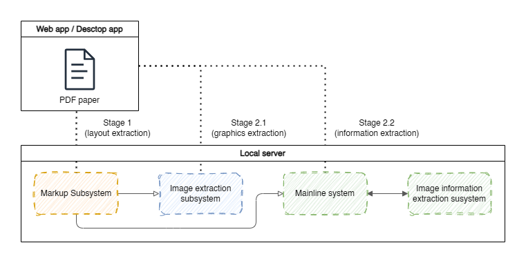

# ML System Design Doc <!-- omit from toc -->
## Дизайн ML системы - Equix v1.0.0 <!-- omit from toc -->

<!-- TOC -->
- [0. Термины](#0-термины)
- [1. Цели и предпосылки](#1-цели-и-предпосылки)
  - [1.1. Зачем идем в разработку продукта?](#11-зачем-идем-в-разработку-продукта)
  - [1.2. Бизнес-требования и ограничения](#12-бизнес-требования-и-ограничения)
  - [1.3. Что входит в скоуп проекта/итерации, что не входит](#13-что-входит-в-скоуп-проектаитерации-что-не-входит)
  - [1.4. Предпосылки решения](#14-предпосылки-решения)
- [2. Методология](#2-методология)
  - [2.1. Постановка задачи](#21-постановка-задачи)
  - [2.2. Блок-схема решения](#22-блок-схема-решения)
  - [2.3. Этапы решения задачи](#23-этапы-решения-задачи)
- [3. Подготовка пилота](#3-подготовка-пилота)
  - [3.0. Дизайн продукта:](#30-дизайн-продукта)
  - [3.1. Способ оценки пилота](#31-способ-оценки-пилота)
  - [3.2. Что считаем успешным пилотом](#32-что-считаем-успешным-пилотом)
  - [3.3. Подготовка пилота](#33-подготовка-пилота)
- [4. Внедрение для production систем](#4-внедрение-для-production-систем)
  - [4.2. Описание инфраструктуры и масштабируемости](#42-описание-инфраструктуры-и-масштабируемости)
  - [4.3. Требования к работе системы](#43-требования-к-работе-системы)
  - [4.4. Нагрузочное тестирование](#44-нагрузочное-тестирование)
<!-- TOC -->

### 0. Термины
> `связанная информация` - последовательность фраз / блоков текста, имеющих логическую связь: например, в потенциальном сравнении древних цивилизаций пары `Финикия - 1200-332 г. до н. э.`, `Цивилизация Ольмеков - 1200-401 г. н. э.` и `Цивилизация Хеттов - 1600-1178 г. до н. э.` будут являться такой информацией.
>
> `общая информация (abstract)` - краткая выжимка научной статьи / её основные концепции.
>
> `работа на локальных мощностях` - объединение двух возможных вариантов работы: на устройстве (без доступа в интернет), а также в браузере с учетом запуска бэкенда на серверах компании.

### 1. Цели и предпосылки
#### 1.1. Зачем идем в разработку продукта?

- **Бизнес-цель:**
    Создание системы для автоматического извлечения ключевой информации из научных pdf-документов, что позволяет ускорить процесс анализа научных статей и внедрение концепций, изложенных в них, в продукты компании.

- **Почему станет лучше:**
    В отличие от существующих решений, которые предлагают исключительно извлечение таблиц, система будет поддерживать извлечение данных из графиков и схем, а также связанной и общей информации. Всё будет работать локально, позволяя обрабатывать закрытые разработки компании.

- **Что будем считать успехом:**
    Успехом будет считаться достижение определенных метрик качества:
  - Точность совпадения табличных данных ≥ 90%.
  - Точность извлеченных данных из не табличных источников информации ≥ 85%.
  - Снижение среднего времени работы со статьями.

#### 1.2. Бизнес-требования и ограничения

- **Краткое описание требований:**
    Система должна обеспечивать быстроту высокую точность извлечения данных из таблиц и графиков из файлов в формате PDF. Система должна уметь работать с данным PDF в различном формате: текстовом и графическом.

- **Бизнес-ограничения:**
     - Поддержка научных PDF-документов на русском языке.
     - Ограничения по времени обработки документа: не более 10 секунд на документ среднего размера (10–15 страниц).
     - Извлечение должно производиться в md формат.
     - Минимальные требования к запуску на устройстве:
        - Nvidia GeForce RTX 3070
        - Intel Core i7 12 gen
        - 32 Gb RAM
        - **или**
        - Apple M2
        - 32 Gb RAM

> Ввиду отсутствия больших обучающих мощностей (они могут меняться по ходу разработки) и наличие выделенного времени на разработку (свыше 6 месяцев) допускается снижение метрик качества для запуска пилота.
>
> Пилот должен быть выпущен не позднее чем через **2 месяца** после начала разработки.

- **Что мы ожидаем от конкретной итерации:**
    Демо-стенд с реализованной логикой по извлечению информации и отчетами по эффективности и точности работы системы.

- **Описание бизнес-процесса пилота:**
    1. Пользователь загружает PDF-документ.
    2. Система анализирует документ, создавая разметку документа.
    3. Пользователь выбирает графическую информацию и формат её извлечения.
    4. Выводится структурированный результат в виде файла нужного формата.
    5. Пользователь проверяет корректность результатов и оставляет отзывы, если требуется.

    **или**

    1. Пользователь загружает PDF-документ.
    2. Система анализирует документ, создавая разметку документа.
    3. Пользователь задает вопрос по содержанию документа.
    4. Система выдает ответ в интегрированый чат.

- **Что считаем успешным пилотом:**
    - Точность извлечения таблиц и графиков ≥ 75%.
    - Скорость обработки PDF-документов ≤ 5 секунд на одну страницу.
    - Высокая устойчивость системы к нестандартным форматам таблиц и графиков.
    - Точность ответов на вопросы ≥ 75%.

- **Возможные пути развития проекта:**
    - Поддержка дополнительных языков документов.
    - Извлечение данных в иные форматы (csv, python код для создания графиков).
    - Поддержка анализа сетевых графиков и других сложных визуализаций.
    - Разработка мобильной версии для работы с документами.
    - Введение функционала отслеживания связанных исследований (через другой проект компании).
    - Создания системы туннелирования и развертывания на серверах компании для предоставления доступа другим бизнесам продукту.
    - Иные пути, согласованые с Заказчиком по результатам Пилота.

#### 1.3. Что входит в скоуп проекта/итерации, что не входит
- **Входит в скоуп:**
    - Предоставляет результатов в формате Markdown.
    - Возможность задавать вопросы по документу.
    - Извлечение данных из таблиц, графиков и рисунков.
    - Локальная работа без подключения к интернету.

- **Не входит в скоуп:**
    - Интерфейс (frontend) для взаимодействия с системой.
    - Извлечение глобальной информации из текста (`связанная информация` и `общая информация`)
    - Возможность запуска на серверных мощностях компании.
    - Анализ сетевых графиков и других сложных визуализаций.
    - Поддержка русского языка (основная часть статей написано на английском, поэтому от русского на данном этапе стоит отказаться).

- **Качество кода и воспроизводимость:**
    - Код должен быть покрытым тестами (не менее 50% покрытия), с воспроизводимой настройкой окружения и зависимостей.
    - Код должен соответствовать настройкам форматеров, указанным в репозитории проекта.

- **Технический долг:**
    - Некоторые оптимизации производительности будут отложены до следующей итерации, как и полное покрытие тестами.
    - Поддержка сложных, нестандартных PDF-форматов.

#### 1.4. Предпосылки решения

**Общие:**
- Рост объема научных публикаций и данных, требующих автоматизированный анализ.
- Появление библиотек, способных производить необходимое обработки без больших вычислительных ресурсов.

**Для решения задачи необходимо:**
1. **От Заказчика:**
   - Предоставить выборку научных PDF-документов для тестирования (не менее 50 документов).
   - Указать приоритетные типы графиков, таблиц и схем для извлечения.
   - Предоставить разметку указанных данных
   - Предоставить описание формата, для извлечения графиков (код / текст с графиков)

1. **От ML-инженера:**
   - Выбор существующих моделей для обработки текста (LLaMA, BERT) и изображений (ResNet, YOLO, SVTR).
   - Поиск информации о возможных методах эффективной блочной разметке.
   - Поиск информации об эффективном представлении визуальных данных для наиболее точного ответа RAG-системы.
   - Информация о существующих SotA подходах для реализации RAG+OCR-систем, с учетом визуальной информации.

---

### 2. Методология

#### 2.1. Постановка задачи
Для реализации системы нужно решить следующие основные задачи:
- Для экрастрактинга информации из графических источников:
  1. Авто-маркирование областей таблиц и графиков
  2. Извлечение из выделенных областей нужной информации
  3. формирование md версии извлечённой информации
- Для экрастрактинга информации из текстовых источников:
   1. Определение ключевых концепций статьи (abstract).
   1. Обнаружение связанных блоков текста (связанных данных).

#### 2.2. Блок-схема решения


#### 2.3. Этапы решения задачи

***Этап 1 - Исследование и подготовка данных.***

Цель:
- Определить список используемых датасетов:
    - Понять, какие должны быть предикторы / таргеты у каждого из необходимых датасетов.
    - Анализ доступных датасетов для каждой из категорий прошлого пункта.
    - Создание описания их структуры (формат данных, объем, качество)
- Определить формат хранения данных:
    - Создание шаблонов, описывающих структуру хранения.
    - Определения формата экстракции графических данных (при правильном подходе, качество RAG-системы заметно выше).
    - Определить подход к загрузке и обработке данных (Just-in-time / Preprocessing).
- Разбить данные на тренировочную выборку, тестовую и валидационную (в случае fine-tunning, распределение - 33 / 33 / 33, в случае обучения с нуля - 70 / 20 / 10)

Таблица с используемыми датасетами:

| Название датасета  | Тип | Описание | Ссылка |
| ------------- | ------------- | ------------- | ------------- |
| ChartQA  | OCR графиков  | Датасет собран из графиков (Line Chart, Pie Chart и Bar Chart) различных статей, а также содержит аугментированные данные / также в датасете содержится набор Q&A и Extraction графиков | [link](https://github.com/vis-nlp/ChartQA/tree/main) |
| PubTable-1M  | OCR таблиц  | Датасет собран из таблиц различных статей и финансовых отчетов и содержит разметку таблиц и опознанные слова в каждом из регионов | [link](https://huggingface.co/datasets/bsmock/pubtables-1m) |
| DocLayNet  | Разметка документов  | Датасет содержит постраничную разметку (включая формулы, таблицы, колонтитулы и др.) для документов различного содержания (финансы, научные статьи и т.д.) | [link](https://huggingface.co/datasets/ds4sd/DocLayNet) |
| SciQAG  | Генератор Q&A для документов о их содержании  | Использует Llama 2 для генерации вопросов и ответов к тексту | [link](https://github.com/MasterAI-EAM/SciQAG) |
| arXiv Dataset  | Научные статьи   | Датасет состоит из статей arXiv разного научного содержания / из разметки есть только Abstract и авторы | [link](https://www.kaggle.com/datasets/Cornell-University/arxiv) |
| NLP and LLM related Arxiv papers  | Научные статьи   | Датасет состоит из статей о NLP и LLM / не содержит никакой разметки | [link](https://www.kaggle.com/datasets/harshsinghal/nlp-and-llm-related-arxiv-papers) |
| Equix  | Научные статьи   | Данные, предоставленные компанией с разметкой и реальными Q&A | no link |

Equix (датасет внутренних документов компании):
- Датасет расширяется весьма небыстро (~1-2 документа в месяц).
- Данные вносятся путем размещения этих документов в специальном директории на серверах компании.
- Данные поступают от отдела по исследованию в областях, связанных с math and compuer science.
- Доразметка вновь создаваемых данных производиться в дальнейшем не будет.
- Части документа не являются конфиденциальной информацией, однако идеи, содержащиеся в нем - являются (поэтому данный датасет не будет публично доступен; обучение на нем не производится).

Особенности данных:
- Часть особенностей описано в [EDA](../eda/datasets_overview.md).
- Feature Engineering не применим в силу отсутствия доступных для исследования фичей (на вход подается только документ или картинка).
- Некоторые датасеты содержат нерелевантную информацию, из-за чего их придется урезать.
- Конфиденциальных данных в датасете не содержится (их содержание также не предполагается).

Ожидаемый результат:
- Графические данные отчищены от не относящихся к ним марок.
- Набор датасетов, распределенный по директориям по типу задач, а также сопроводительная информация в виде таблиц в формате CSV для хранения предикторов.
- Два датасета для:
    - Baseline - практически или вовсе нет train-а; датасет урезан до ~30k сэмплов; добавлены аугментационные данные (графики вставлены в случайные места статьи).
    - MVP - полный набор данных (без аугментации); для графических данных в статьях выполнена процедура OCR через Baseline.

Риски:
- Набор графиков включает в себя лишь три типа графиков: Line Chart, Pie Chart и Bar Chart. Нет графиков для теоретических значений (возможно, эти графики стоит сгенерировать самостоятельно или извлечь из других данных).
- Структурное отличие данных в датасетах от статей компании (использовать статьи компании можно только для валидации, и то, в очень небольшом объеме: самих статей довольно мало ~100 штук). Для минимизации можно искусственно создавать похожие статьи, например, уменьшая информацию при помощи суммаризирования или добавляя схожие по стилистике фиктивные графики.

 ***Этап 2 - Обработка данных-документов для извлечения информации из графических данных***

Цель: Доразметить данные для дальнейшего обучения итоговых моделей и проверки качества их работы и заменить исходные датасеты на один, полностью соответствующий изначальной задаче.

Ожидаемый результат:
- Для статей из датасета будут добавлена разметка layout-а, данные графиков и таблиц в текстовом виде.
- Изначальные данные других категорий (не RAG над статьями) заменены на доразмеченные.

Риски:
- Разметка может получиться некачественной, в силу отсутствия каких-либо элементов маркирования, вследствие чего может попытаться и вся остальная доразметка. Стоит проверить качество разметки и в случае плохих результатов, найти другие датасеты / разметить данные самостоятельно. Или можно вообще отказаться от доразметки структуры дополнительных документов.
- Классы для меток в layout, а также типов графиков могут перестать быть сбалансированными из-за чего итоговая модель может недоучиться на мало-представленных классах, что может плохо сказаться на итоговом качестве системы. Для решения проблемы стоит произвести аугментацию, просто вставив блоки в случайные места.

Замечание:
- Данные могут быть доразмечены и после этапа 3 при помощи Baseline

 ***Этап 3 - Разработка базовой модели***

Цель: Выбрать модели и составить архитектуру для базового решения задачи, которое будет удовлетворять пониженным условиям скорости работы (~5 секунд на запрос) и пониженным метрикам качества.

В качестве базовой модели была выбрана [Llama 3.2 Multimodal](https://ai.meta.com/blog/llama-3-2-connect-2024-vision-edge-mobile-devices/) (для обработки запросов о содержании документа и извлечения данных из картинки).

Структура Baseline весьма похожа на структуру MVP, однако вместо всех моделей будет использоваться `Llama 3.2`. Кроме того, не будет осуществляться никакой генерации запросов для извлечения данных из картинки.

Для запросов на извлечение дынных из таблиц будут созданы промпты с примерами извлечения. Области для извлечения необходимо отметить самостоятельно.

Валидация полученной модели будет проводиться при помощи подготовленных данных (графиков и текстов):
- Для понимания общей информации модели будет подан контекст, а за ним вопрос по контексту.
- Для умения извлекать данные из графики, модели будет подана картинка, а также заготовленный промпт для наиболее эффективного извлечения данных из картинки.

Риски:
- Модель может не следовать указанному формату и выдавать "мусор", из-за чего оценка качества будет не очень корректной. Для минимизации риска стоит использовать алгоритмическое обрезание пояснений и другого "мусора".

Для перехода к следующему этапу необходимо подобрать промпты для наиболее эффективного извлечения визуальных данных и посчитать метрики на датасетах (за исключением датасета с разметкой).

 ***Этап 4 - Интерпретация результатов и согласование с заказчиком***

Цель:
- Представить полученные результаты бизнесу:
    - Выяснить, являются ли текущие результаты приемлемыми и стоит ли разрабатывать MVP (или достаточно использовать Baseline)
    - Установление точности в новых метриках для конечной модели.

Подход:
- Демонстрация положительных и отрицательных примеров работы системы: правильно извлеченные данные из статьи заявки, ошибки модели.
- Выбор и демонстрация метрики качества:
    - Для численных данных будем использовать метрику $R_2$. Мы хотим извлекать данные из графиков, у которых не каждая точка может иметь значения `X` и `Y`, поэтому небольшие отклонения нам не сильно важны, однако отклонения за пределы меток могут выдать неправильный итоговый результат (вместо убывания может получиться возрастание).
    - Для строчных ответов будем использовать метрику $F_1$ — это гармоническое среднее между Precision (точность) и Recall (полнота). Используется, где критичен неправильный ответ. В нашем случае неправильный retrieval может привести к итоговому неправильному ответу пользователя.
    - Для разметки будем использовать метрику $iou$ (обычно эта метрика используется в компьютерном зрении для проверки качества выделения областей объектов; показывает, на хорошо покрывается объект и учитывает упущенные и ложные регионы).
    - Для RAG создадим эмбеддинги реального и сгенерированного ответа (будем использовать [mini-lm](https://huggingface.co/sentence-transformers/all-MiniLM-L6-v2)). Между ответами посчитаем среднее косинусное расстояние (Ожидаемая точность не меньше 70%). Эта метрика позволит для ответов, составленных из синонимов, наиболее точно посчитать схожесть идей ответов.
- Обсудить проблемы: время инференса, допустимость представленных ошибок, используемые ресурсы.

Ожидаемый результат:
- Бизнес убеждается, что проект имеет потенциал и согласовывает дальнейшие этапы на разработку MVP.
- Будут уточнены требования к данным и результатам самой модели.

Риски:
- Baseline может оказаться слишком сильным и полностью закрыть потребности бизнеса. Если бейзлайн работает, значит мы смогли соптимизировать разработку проекта (что в некотором роде положительный результат).

 ***Этап 5 - Разработка и оценка MVP модели***


*(архитектура взаимодействия с проектом | архитектура основана на статьях [1](https://arxiv.org/pdf/2210.02830) и [2](https://arxiv.org/pdf/2409.18839))*

Для архитектуры были выбраны следующие модели:
- Разметка - [DETR-layout-detection](https://huggingface.co/cmarkea/detr-layout-detection)
- Экстракция информации из картинок - [mPLUG-DocOwl 1.5](https://arxiv.org/pdf/2403.12895)
- Основная модель общения - [Llama 3.2 Multimodal](https://ai.meta.com/blog/llama-3-2-connect-2024-vision-edge-mobile-devices/) / [Llama 3.2-3B](https://huggingface.co/meta-llama/Llama-3.2-3B) / [
Qwen2.5-1.5B](https://huggingface.co/Qwen/Qwen2.5-1.5B) / [DeepSeek V2.5-21B](https://www.deepseek.com/) (в случае нехватки инференса, будет применяться квантизации / сокращение числа задач, в которых используется модель)
> ***для основных моделей будет проведено сравнение качества ответов на вопросы тестирования, а также время инфересная (по критерию удовлетворения БТ); для каждой категории вопросов (по тексту / по картинкам или графикам / по всему документу) будет выбрана своя модель***

Риски:
- Выбранная архитектура может оказаться неэффективной для решения поставленных задач и работать хуже Baseline-а. Для минимизации этого риска стоит продумать иные архитектуры, которые могут решить данную проблему.
- Выбранные модели могут быть неэффективными с точки зрения производительности. Для минимизации этого риска, стоит рассмотреть другие модели на их замену.

Ожидаемый результат:
- Есть готовое консольное приложение, которое способно выполнять поставленные бизнес-задачи.
- Архитектура является рабочей и выдает корректные результаты для вопросов о графических данных.

 ***Этап 6 - Интерпретация моделей***

Цель:
- Создать интерпретатора для объяснения предсказаний
- Выявить, на какие данные модель обращает внимание (а на что вообще не смотрит):
    -  Проверить использование графической информации итоговой моделью

Риски:
- Полученная модель может полностью игнорировать графическую информацию и фокусировать лишь на тексте, что приведёт её к неспособности выдавать точные ответы в отношении вопросов про графические данные. Для минимизации рисков стоит проводить тестирование на внимание каждого из блоков, после его обучения / настройки, дабы не оптимизировать остальные блоки под некорректно работающий.

Ожидаемый результат:
- Модель обращает внимание на места, релевантные заданным вопросам.
- Ошибки возникают вследствие непонимания данных, а не вследствие фокуса на нерелевантных данных.

 ***Этап 7 - Подготовка финального отчета для бизнеса и согласовании дальнейших планов развития***


*(в случае достаточного количества ресурсов, будет создан предварительный графический интерфейс)*

Цель:
- Сформировать финальный отчёт и презентацию для бизнеса:
    -  Продемонстрировать работу MVP на данных компании
    -  Сравнить работу с Baseline: на проблемные места каждой из итераций, сравнить метрики
- Представить полученные результаты бизнесу:
    - Обосновать целесообразность внедрения составленного решения
    - Согласовать план дальнейшего расширения функционал
- Согласование перехода к пилоту

Ожидаемый результат:
- Итоговый отчёт, подтверждающий достижение бизнес-целей.
- Бизнес одобряет дальнейший запуск пилота и стратегию развития проекта (например, выход за пределы компании и становление отдельным продуктом).

---

### 3. Подготовка пилота

#### 3.0. Дизайн продукта:

В начале запуска пилота `GUI` не планировался. Доступ будет предоставляться по `CLI` в двух форматах в зависимости от задач: `chat` (стандартный диалог с моделью о прикрепленной статье) и `extraction` (выделение данных из изображения в заданной области, а также возможность задать вопрос об извлеченных данных).

В дальнейшем будет представлен интерфейс реализующий функционал `CLI` в виде графического интерфейса с возможностью извлечения данных из найденных картинок, а также с возможностью задать вопрос об извлеченных данных или документе целиком:

- **Центральная часть** - окно с выбранным pdf документом, а также выделенными областями, где были найдены графики / таблицы / изображения с кнопкой для их экспортирования. После выбора формата результат экспортирования будет добавлен в чат.
- **Чат-панель**  (правая панель) - панель с историей чата, а также историей экспорта. Для каждого элемента экспорта можно изменить его формат / скопировать / сохранить. Тут же можно задать вопрос о конкретной табличке / графике / рисунке с контекстом в виде самого документа или же об информации, содержащейся в документе.

#### 3.1. Способ оценки пилота

Для оценки пилота будут использоваться метрики оценки моделей на реальных вопросах и ожидаемых ответах. Также будет проведён замер инференса и сверка с целевыми значениями продукта.

Кроме того, будет проведено дополнительное **A/B-тестирование** на основе лучших моделях, полученных на этапе **Разработка и оценка MVP модели**.

Подготовка пилота включает в себя:
- **Формирование двух выборок**: пилотной и контрольной с учетом используемых материалов (только pdf-статьи / pdf-документы более общего характера) и задач (только извлечение данных, например таблица-картинка -> таблица-md / поиск ключевой и связной информации / повседневное использование).
- **Определение длительности пилота** на основе статистических методов для выявления минимально детектируемого эффекта уровня значимости `0.05` и мощностью теста не ниже `0.7`.

#### 3.2. Что считаем успешным пилотом

Пилот считается успешным при достижении ключевых метрик из бизнес-требований, а также поставленной точности для `MVP`:
- Точность работы RAG-системы по косинусному расстоянию между эмбеддингом эталонного ответа и полученного ≥ 70%.
- Точность извлечения таблиц и графиков по доп. обработки (удаления пояснений и корректировка ошибок формата) по метрикам $R_2$ и $F_1$ ≥ 75%.
- Скорость обработки PDF-документов ≤ 5 секунд на одну страницу.
- Высокая устойчивость системы к нестандартным форматам таблиц и графиков.

#### 3.3. Подготовка пилота

Для подготовки пилота потребуются следующие мощности:
- 200 ГБ на данные для тестирования, а также модели.
- Одна видеокарта A100 в случае надобности дообучения моделей и их fine-tuning-а.

Также для проведения самого пилота потребуются устройства со следующими минимальными характеристиками:
- Nvidia GeForce RTX 3070
- Intel Core i7 12 gen
- 32 Gb RAM
- **или**
- Apple M2
- 32 Gb RAM

_В ходе разработки основной модели архитектура может измениться и первоначальным вычислительным мощности для её содержания могут быть пересчитаны с учетом дальнейшей доработке для запуска в рамках первоначальных ограничений._

---

### 4. Внедрение для production систем

_(архитектура взаимодействия пользователя с системой)_

Схему API можно описать следующим образом:

```
> Layout extraction

->
{
    token: [in case of external server use],
    document: <binary pdf document>
}

<-
{
    layout: <JSON-document / image blocks only>,
    document_id: <string>
}

====

> Graphics extraction

->
{
    token: [in case of external server use],
    document_id: <string>,
    layout_block_id: <Int>,
    output_type: <string>
}

<-
{
    status: <Indicate if session is valid>,
    text: <Extraction result / can be in form of code or md>
}

====

> Information extraction

->
{
    token: [in case of external server use],
    document_id: <string>,
    prompt: <Text of the question>
}

<-
{
    status: <Indicate if session is valid>,
    answer: <Information extraction result>
}

```

_Запросы могут быть уточнены или изменены в зависимости и направления развития (например, внедрения экстракции информации по шаблону)_

#### 4.2. Описание инфраструктуры и масштабируемости

В случае локального запуска масштабируемость не предусмотрена.

Поскольку сама система адаптирована к запуску на устройствах, больших серверных мощностей не требуется, поэтому достаточно всего одной серверной машины, масштабирование в которой будет происходить за счет [vLLM](https://docs.vllm.ai/en/latest/). В случае успешности пост-пилотного запуска, а также развития продукта может возникнуть потребность в дополнительных машинах, масштабирование на которые будет осуществляться при помощи [Kubernetes](https://kubernetes.io/).

Конфигурация одной инференсной машины:
- Nvidia Tesla V100s
- Intel Silver 4314 (16 x 2.4 ГГц)
- 48 Gb RAM
- 500 Gb SSD ROM

Издержки: **~ 85 тыс. руб. в месяц** ([Selectel](https://selectel.ru/services/dedicated/configurator/?tab=configuratorGpu)). Реальные - 0 ввиду наличия нужных мощностей у компании.

#### 4.3. Требования к работе системы

- **Запросы между сервером и клиентом должны шифроваться**, а **количество передаваемой информации должно быть минимально** ввиду нагруженности сетей компании. Для локального запуска такие ограничения отсутствуют.

- **Особых требований к надежности системы нет** (в случае её падения, задачи системы могут быть выполнены в ручном режиме).

- **Среднее суммарное время исполнения запросов** (с учетом времени передачи данных по сети) извлечения графики не должно превышать **3 секунды**, а время **ответа на вопросы по документу** не должно превышать **10 секунд**.

#### 4.4. Нагрузочное тестирование

На этапе пилота нагрузочное тестирование не планируется, однако в дальнейшем планируется провести испытания на продукте, размещенном на серверных мощностях (_конфигурация будет определена позднее_), а также на мощностях одного устройства (с конфигурацией: `Nvidia GeForce RTX 3070, Intel Core i7 12 gen, 32 Gb RAM`). В рамках этого тестирования будут использованы специальные файлы (содержащие только графики конкретного типа, большое количество текста или же большое число элементов разметки), за счёт чего будет проверено быстродействие каждой из подсистем.

В случае испытаний системы на серверных мощностях будет также протестированы максимальное число пользователей, которое способна выдержать система без существенных замедлений (документы для тестирования будут случайно выбраны из тестовой выборки).

_На конфигурациях `Apple` проведение тестирования не предполагается, т.к. данные мощности не являются основными для компании и, в случае их замедления, система для них будет развернута на серверах компании._

---

> ### Материалы для дополнительного погружения в тему
> - [Подход для OCR научных статей](https://arxiv.org/abs/2210.02830)
> - [Алгоритмическое извлечение таблиц](https://pypi.org/project/tabula-py/)
> - [ML подход для извлечения данных на основе собственной модели](https://github.com/Filimoa/open-parse/tree/main)
> - [ML подход для извлечения данных на основе zero-shot gpt-mini](https://github.com/getomni-ai/zerox?tab=readme-ov-file), а также другие модели [aws](https://aws.amazon.com/textract/pricing/#:~:text=Amazon%20Textract%20API%20pricing), [google](https://cloud.google.com/document-ai/pricing), [azure](https://azure.microsoft.com/en-us/pricing/details/ai-document-intelligence/) и [evaluation разных LLM](https://github.com/BradyFU/Awesome-Multimodal-Large-Language-Models/tree/Evaluation)
> - Конференция, посвященная работе с документами и их распознаванию - [ICDAR 2024 Proceedings](https://icdar2024.net/procceedings/)
> - [SotA подход для RAG систем](https://arxiv.org/pdf/2409.18839) для работы с документами сложной разметки (с заголовками, колонтитулами, формулами)
> - [Лекция LlamaIndex Webinar](https://www.youtube.com/watch?v=nzcBvba7mzI) об эффективном извлечении информации с помощью визуальных моделей.
> - [mPLUG-DocOwl 1.5: Unified Structure Learning for OCR-free Document Understanding](https://arxiv.org/pdf/2403.12895)
