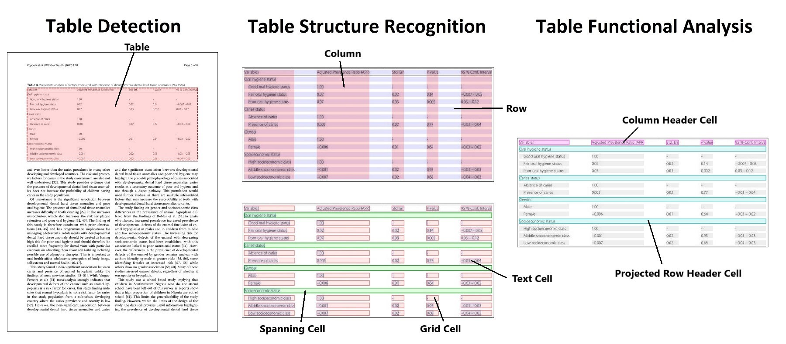

# RAG+OCR-система для работы с научными статьями в формате pdf: EDA

Целью этапа EDA был поиск и изучение данных для обучения и проверки моделей системы.

***Заметка:** для данной системы не существует датасетов, которые бы могли полностью решить поставленные задачи, поэтому был собран комплекс датасетов, каждый датасет в котором решает свою подзадачу и может быть доразмечен с помощью моделей, обученных на других датасетах.*

## Найденные данные:
### Датасет для графики ([ChartQA](https://huggingface.co/datasets/ahmed-masry/ChartQA)):

- Формат данных:

| imgname | query | label | type | image |
|---------|-------|-------|------|-------|
| ChartQAExample.png | Is the value ... | Yes | human | [ 137, 80, 78, 71, ... |

и таблицы для каждой из картинок (X = Значения по дата / секциям | Y = Фичи)

- Информация о данных:
    - Общее количество - **14.2k** (train) + **1.3k** (test) + **0.96** (val)
    - Среди них **73.9%** - данные с аугментацией
    - Распределение по типам графиков - **50** (BarChart) / **35** (LineChart) / **15** (PieChart)

- Замечания:
    - Таблички можно использовать для генерации изображений с таблицами, однако они весьма однотипные.
    - На картинках очень много мусора: источник, вопросы и вотермарки.
    - Вопросы весьма простые (подразумевают односложный ответ).

### Датасет для таблиц ([PubTable-1M](https://huggingface.co/datasets/bsmock/pubtables-1m)):

- Формат данных:

- Информация о данных:
    - Общее количество - **947k**
    - Данные разделены на поиск границ и идентификацию слов.
    - Таблички разной структуры (с сепарацией строк и подпунктами в шапке) и разного размера (от 1-й строки до 30-и).

- Замечания:
    - Сам датасет - всего лишь разметка таблиц с экстракцией данных, данные можно алгоритмически обработать и получить датасет `картинка -> табличка в json формате`.

### Датасет для layout-а ([DocLayNet](https://huggingface.co/datasets/ds4sd/DocLayNet)):

- Формат данных:

| image_id | image | width | height | doc_category | collection | doc_name | page_no | objects |
|---------|-------|-------|------|-------|-------|-------|-------|-------|
| 0 | image_data | 1025 | 1025 | scientific_articles | ann_reports_00_04_fancy | NYSE_EL_2003.pdf | 80 | [ { "category_id": 4, "image_id": "51",.... |

- Информация о данных:
    - Документы из нескольких областей: `Scientific`, `Patents`, `Manuals`, `Laws`, `Tenders`, `Financial` (17 / 8 / 21 / 16 / 8 / 32)
    - Общий объем - **91.1k** страниц

- Замечания:
    - В разметке присутствуют графики разных видов, в том числе и радиальных.
    - Области не перекрываются, однако блоки разделены между собой относительно странным образом: некоторые разделены на части (для того, чтобы не было пересечений), а некоторые - объединены в один кластер.
    - Датасет имеет не только документы на английском, но и документы на китайском.
    - От существенной части датасета (~80%) придется избавиться, ибо данные не подходят для моделей

### Генератор датасета для RAG-системы ([SciQAG](https://github.com/MasterAI-EAM/SciQAG)):

- Формат данных:

> 'Q': 'Q: What are the key factors that can affect the deformation behaviour of nanocrystalline metals?',
>
> 'A': 'A: The key factors that can affect the deformation behaviour of nanocrystalline metals include the grain size, the grain-boundary-based deformation mechanism, the elastic constants, the plastic deformation rate, and the initial stress.',
>
> 'Q': 'Q: How does the grain size affect the deformation behaviour of nanocrystalline metals?',
>
>  'A': 'A: As the grain size becomes smaller, the strength of the grain boundaries becomes larger, leading to a decrease in the deformation rate. Additionally, the presence of dislocations is affected by the grain size, with more dislocations observed in larger grains.',
>
> 'Q': 'Q: What is the main advantage of using molecular-dynamics simulation in studying the deformation behaviour of nanocrystalline metals?',
>
>  'A': 'A: The main advantage of using molecular-dynamics simulation in studying the deformation behaviour of nanocrystalline metals is that it allows for the investigation of the internal structure and dynamics of the nucleated dislocations at the atomic level. This is in contrast to experimental techniques, which can only provide macroscopic observations.',

- Информация о данных:
    - Общий объем зависит от вычислительных мощностей.
    - Выбор основных статей может быть любым.

- Замечания:
    - Это авто-генерируемый датасет, поэтому ответы могут быть не точными и не соответствовать информации с картинок.
    - Я не смог найти других датасетов для данной тематики (есть медицинские, финансовые, но научных нигде нет ={ )

### Дополнительные данные ([arXiv Dataset](https://www.kaggle.com/datasets/Cornell-University/arxiv) | [NLP and LLM related Arxiv papers](https://www.kaggle.com/datasets/harshsinghal/nlp-and-llm-related-arxiv-papers)):

- Формат данных:

- Информация о данных:
    - Документы из всех возможных областей, которые появлялись на arXiv за последнии 10 лет.
    - Общий объем - порядка **1.7m** статей.

- Замечания:
    - Датасет представляет из себя просто набор из документов, с извлеченными алгоритмическим путём abstract-ми и авторами.
    - Может быть использован для расширения датасетов, путем доразметки.
    - Могу иметься пересечения с другими датасетами.

## Датасеты для тестирования:

***Заметка:** датасет для тестирования содержит внутренние исследования компании и является конфиденциальным, поэтому тут будут только описания находок.*

- Информация о данных:
    - Документы в основном из области Computer Science и Math Science.
    - Отличительной особенностью является наличие большого числа графических элементов (картинок / таблиц / графиков). Примерно по 2-3 штуки на каждую страницу.
    - Сами документы не очень большие (не более 15 страниц).
    - Всего документов около 100 штук.
